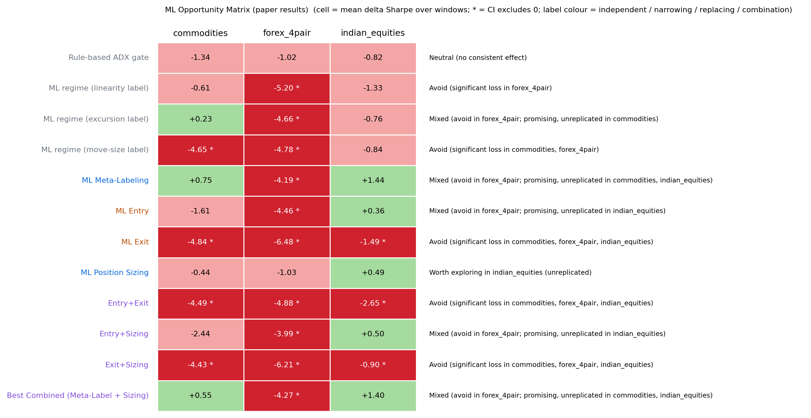

# ML Component Attribution (MBCA)

**Where should machine learning go in a hybrid trading system?**
This repository contains the paper *"Where Should Machine Learning Go in Hybrid Trading Systems?
Matched-Budget Component Attribution Across Three Markets"* ([`paper/MBCA_paper.pdf`](paper/MBCA_paper.pdf)).
It also contains a small, tested Python package, `mbca`, that runs the paper's method on **your own strategy** in a few lines.

<p align="center"></p>

## The idea in one paragraph

Most "ML for trading" results bolt a model onto a rule-based strategy and report one before/after number.
That does not tell you *which decision* the ML actually improved. **Matched-Budget Component Attribution (MBCA)**
holds a validated rule-based strategy fixed and replaces **one insertion point at a time** with an ML model. Every
swap shares the same features, the same model, the same hyperparameters, and the same freeze → holdout → forward protocol.
That way a change in Sharpe can be attributed to the insertion point itself:

| Insertion point | Rule-based control | ML replacement | Taxonomy |
|---|---|---|---|
| Regime filter | ADX ≥ 25 gate / no gate | trend/chop classifier gates entries (3 label definitions) | independent |
| Meta-labeling | take every signal | P(this trade wins) ≥ 0.5 filter | narrowing |
| Position sizing | 1× every trade | size = 2 × P(win), in [0, 2] | narrowing |
| Entry | JMA(7)/JMA(21) crossover | long/short "target-before-stop" classifiers | replacing |
| Exit | ATR stop/target or trailing stop | "still favourable in 10 bars?" classifiers + 3×ATR safety stop | replacing |

Plus the combinations Entry+Exit, Entry+Sizing, Exit+Sizing, and Best Combined (Meta-Label + Sizing).

**Paper result (60 configurations, 3 markets, holdout + forward windows):** **0** significant improvements and
**20** significant losses. ML Exit loses significantly in 4 of its 5 configurations, by the same mechanism
each time: early learned exits inflate trade count 2.7-4.2×. Narrowing components (meta-labeling, sizing) are the only directionally positive ones. The closest call is
Best Combined in Indian equities (Sharpe 2.84 → 4.01, not significant).

## Install

```bash
git clone https://github.com/Cannonbold2412/ML_Component_Attribution.git
cd ML_Component_Attribution
pip install -e .          # numpy, pandas, scipy, scikit-learn, lightgbm, matplotlib
pytest -q                 # 19 tests, about 1 minute
```

## Quickstart (about 1 minute)

```python
import mbca

cfg = mbca.MARKETS["commodities"]            # the paper's freeze + forward dates
frames = mbca.load_market("commodities")     # bundled daily OHLC, {ticker: DataFrame}

meta = mbca.MetaLabel()
res = mbca.run_mbca(frames, [meta, mbca.PositionSizing(meta), mbca.Exit()],
                    split_date=cfg["split"], forward_start=cfg["forward"], base=cfg["pipeline"])
print(res.table)     # per variant x window: n_trades, sharpe, delta_sharpe, deflated_sharpe, CI, significant
print(res.matrix())  # the paper's mechanical Adopt / Avoid / Mixed / Worth-exploring recommendation
```

## Plug in your own strategy

A strategy is a `Pipeline` of plain functions. Swap in yours, and MBCA tells you where ML helps it:

```python
import mbca

def donchian(df, lookback=20):                        # df -> +1 / -1 / 0 per bar, backward-looking only
    hi = df["high"].rolling(lookback).max().shift(1)
    lo = df["low"].rolling(lookback).min().shift(1)
    return (df["close"] > hi).astype(int) - (df["close"] < lo).astype(int)

mine = mbca.Pipeline(signal_fn=donchian, signal_grid={"lookback": [20, 55]},
                     exit_fn=mbca.trailing_exit, stop_grid={"sl_mult": [1.5, 2.0], "trail_mult": [2.0, 3.0]},
                     fee_bps=7.0)

frames = {"XYZ": mbca.load_csv("my_data/XYZ.csv")}  # columns: Date, open, high, low, close
res = mbca.run_mbca(frames, mbca.paper_components(), split_date="2021-01-01", base=mine)
```

The full template is [`examples/02_plug_your_strategy.py`](examples/02_plug_your_strategy.py)
(`python examples/02_plug_your_strategy.py path/to/csv_folder`). You can also add your own ML component: any object
with `name`, `kind`, `fit(frames, split_date, base)`, and `apply(pipeline) -> pipeline` works.

## Examples

| Script | What it does | Time |
|---|---|---|
| `examples/01_quickstart.py` | meta-labeling + sizing on commodities | ~1 min |
| `examples/02_plug_your_strategy.py` | template for your own strategy / data | ~1 min |
| `examples/03_reproduce_paper.py [market]` | full paper grid, all 3 markets → `results/replication/` | ~15 min |
| `examples/04_paper_results.py` | the paper's published numbers → matrix + corrected figures | seconds |

## What's in the repo

```
mbca/            the package: indicators, 8 shared features, pipeline + walk-forward, 5 components,
                 MBCA protocol, statistics (deflated Sharpe, bootstrap CI), figures
data/            bundled daily OHLC (.csv.gz): forex (4 pairs), commodities (5), indian_equities (48 NIFTY-50)
results/paper/   the paper's published numbers (component_attribution_table.csv + per-component CSVs)
results/replication/   this package's independent re-run of the full grid
paper/           manuscript (LaTeX + PDF), figures, bibliography, build script
tests/           no-lookahead, freeze/leakage, exit-engine, composition, statistics, end-to-end
ERRATA.md        what changed from Draft v3 and why
```

## Guarantees the tests enforce

* **No lookahead:** every feature at bar *t* equals the feature computed on data truncated at *t*.
* **Freeze:** each ML model is fit once, before the split. Scrambling *all* post-split data leaves every fitted
  model bit-for-bit identical, and training labels that straddle the split are excluded.
* **One insertion point per component:** each component replaces exactly one pipeline function. Sizing never adds
  or removes a trade, and meta-labeling only removes trades.
* **Exit engines** match hand-computed stop / target / trailing-stop outcomes, and only one position is open per
  instrument at a time.

## Independent replication, and how faithful it is

`mbca` is a from-scratch re-implementation, not a copy of the study's internal code. Running
`examples/03_reproduce_paper.py` on the bundled data gives the numbers in `results/replication/`:

| | Paper | This replication |
|---|---|---|
| Configurations with a CI | 60 | 60 |
| Significant improvements | **0** | **0** |
| Significant losses | 20 | 12 |
| Sign of ΔSharpe agrees | | 49 / 60 |
| ML Exit: significant loss in | all 3 markets | all 3 markets |
| ML Exit trade-count inflation | 2.7-4.2× | 2.4-3.0× |
| Forex: significant losses | 10 / 12 | 2 / 12 |
| Best Combined, Indian equities (holdout / forward ΔSharpe) | +1.16 / +1.65 | +0.04 / +1.53 |

**The method-level conclusions replicate:** no ML component significantly beats the rule-based system at this budget,
ML exit is structurally harmful, and only the narrowing components are worth further study. **The market-level and
effect-size claims do not replicate reliably.** "Forex is hostile to ML" depends on the data vendor and cost model, and
the Best Combined near-miss replicates on the forward window but not on the holdout. The config-by-config comparison is in
`results/replication/paper_vs_replication.csv` and in the paper's replication table (section "Reference Implementation and Independent Replication").

Where this implementation deliberately differs from the original study pipeline, which is why numbers are close
but not identical:

* **Forex data and costs:** the paper used a Yahoo-sourced forex tree (no longer available) with per-pair spread and
  swap costs. The bundled forex data comes from a different vendor, and every market uses a flat 7 bps round-trip cost.
* **Indian equities:** the paper applied an annual sector-curation overlay to every variant's trade book. `mbca`
  trades all 48 instruments, with no overlay.
* **Windows:** the paper re-ran the forward window on a separately fetched data tree, whose walk-forward folds sat on
  different boundaries. `mbca` runs one walk-forward over the full bundled history and scores trades by entry date.
* **Shared model:** Position Sizing reuses the Meta-Label model object instead of re-fitting an identical copy. The
  result is the same up to LightGBM determinism, and this was the paper's own Future Work item.

## Statistics, stated precisely

A trade stream becomes a daily series by averaging the returns of the trades that exit each day. Sharpe ratios are annualized
with a 6%/yr risk-free rate. The 95% CI is a 2,000-replicate bootstrap of the difference in **per-day** Sharpe
(i.i.d., unpaired, as in the paper; `paired_ci=True` gives a date-paired alternative). "Significant" means the CI
excludes 0. The deflated Sharpe ratio corrects for the number of same-type variants screened. See
[ERRATA.md](ERRATA.md) for why this paragraph exists.

## Not financial advice

This is a research method and a negative-results paper. Nothing here is a validated, deployable trading strategy.

## Citation

```
@misc{mbca2026,
  title  = {Where Should Machine Learning Go in Hybrid Trading Systems? Matched-Budget Component Attribution Across Three Markets},
  year   = {2026},
  note   = {Version 4. Code: https://github.com/Cannonbold2412/ML_Component_Attribution}
}
```

MIT licensed. Bundled market data is included for research reproducibility only. Check your data vendor's terms before
redistributing it.
