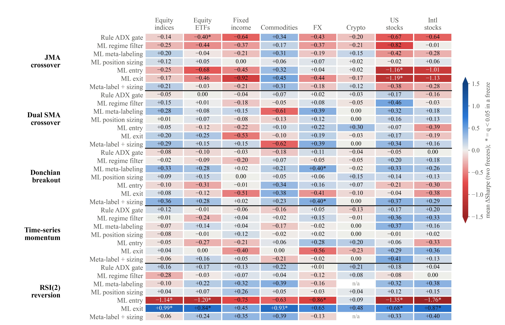

# ML Component Attribution (MBCA)

**Where should machine learning go in a hybrid trading system?**
This repository contains the paper *"Where Should Machine Learning Go in Hybrid Trading Systems?
Matched-Budget Component Attribution Across Five Strategies and 153 Instruments"*
([`paper/MBCA_paper.pdf`](paper/MBCA_paper.pdf), Version 5). It also contains the complete, auditable research
pipeline behind it, and a tested Python package, `mbca`, that runs the method on **your own strategy** in a few lines.

**Code, data, experiments and paper are one system.** A single pre-registered configuration file
([`study.toml`](study.toml)) drives data collection, every experiment, and every table, figure and in-text
number of the paper. Nothing in the paper's results is typed by hand, and a test fails if anything is.

<p align="center"></p>

## The idea in one paragraph

Most "ML for trading" results bolt a model onto a rule-based strategy and report one before/after number.
That does not tell you *which decision* the ML actually improved. **Matched-Budget Component Attribution (MBCA)**
holds a validated rule-based strategy fixed and replaces **one insertion point at a time** with an ML model. Every
swap shares the same features, the same model, the same hyperparameters, and the same freeze → holdout → forward protocol.
That way a change in Sharpe can be attributed to the insertion point itself:

| Insertion point | Rule-based control | ML replacement | Taxonomy |
|---|---|---|---|
| Regime filter | ADX ≥ 25 gate / no gate | trend/chop classifier gates entries (3 label definitions) | independent |
| Meta-labeling | take every signal | P(this trade wins) ≥ 0.5 filter | narrowing |
| Position sizing | 1× every trade | size = 2 × P(win), in [0, 2] | narrowing |
| Entry | JMA(7)/JMA(21) crossover | long/short "target-before-stop" classifiers | replacing |
| Exit | ATR stop/target or trailing stop | "still favourable in 10 bars?" classifiers + 3×ATR safety stop | replacing |

Plus the combinations Entry+Exit, Entry+Sizing, Exit+Sizing, and Best Combined (Meta-Label + Sizing).

**Two studies.** *Study 1* applies MBCA to one strategy (a JMA crossover) in three markets. *Study 2*, pre-registered
before any of its data existed, applies it to five historically documented strategies: JMA and dual moving-average
crossovers, Donchian breakouts, time-series momentum, and RSI(2) mean reversion. It covers 153 daily series
in 8 asset-class markets (equity indices of many countries, sector/country ETFs, bonds, commodities, FX incl. emerging
markets, crypto, and US and international stocks), with two independent freeze dates, close-price stop fills, per-market
costs, mark-to-market portfolios, a paired block bootstrap, and false-discovery-rate control.

**Key results** are in [`results/SUMMARY.md`](results/SUMMARY.md). That file is generated by the pipeline from the same
numbers the paper uses, so it can never disagree with the paper. In one line: ML rarely changes a historically
successful rule significantly. Narrowing components (meta-labeling, sizing) are small, mostly positive, safe, and
transferable. Replacing components are strategy-dependent: ML entry hurts, and ML exit helps only mean reversion.
Realistic execution matters more than any ML component.

## Install

```bash
git clone https://github.com/Cannonbold2412/ML_Component_Attribution.git
cd ML_Component_Attribution
pip install -e .          # numpy, pandas, scipy, scikit-learn, lightgbm, matplotlib
pytest -q                 # the full test suite, about 1 minute
```

## Quickstart (about 1 minute)

```python
import mbca

cfg = mbca.MARKETS["commodities"]            # the paper's freeze + forward dates
frames = mbca.load_market("commodities")     # bundled daily OHLC, {ticker: DataFrame}

meta = mbca.MetaLabel()
res = mbca.run_mbca(frames, [meta, mbca.PositionSizing(meta), mbca.Exit()],
                    split_date=cfg["split"], forward_start=cfg["forward"], base=cfg["pipeline"])
print(res.table)     # per variant x window: n_trades, sharpe, delta_sharpe, deflated_sharpe, CI, significant
print(res.matrix())  # the paper's mechanical Adopt / Avoid / Mixed / Worth-exploring recommendation
```

## Plug in your own strategy

A strategy is a `Pipeline` of plain functions. Swap in yours, and MBCA tells you where ML helps it:

```python
import mbca

def donchian(df, lookback=20):                        # df -> +1 / -1 / 0 per bar, backward-looking only
    hi = df["high"].rolling(lookback).max().shift(1)
    lo = df["low"].rolling(lookback).min().shift(1)
    return (df["close"] > hi).astype(int) - (df["close"] < lo).astype(int)

mine = mbca.Pipeline(signal_fn=donchian, signal_grid={"lookback": [20, 55]},
                     exit_fn=mbca.trailing_exit, stop_grid={"sl_mult": [1.5, 2.0], "trail_mult": [2.0, 3.0]},
                     fee_bps=7.0)

frames = {"XYZ": mbca.load_csv("my_data/XYZ.csv")}  # columns: Date, open, high, low, close
res = mbca.run_mbca(frames, mbca.paper_components(), split_date="2021-01-01", base=mine)
```

The full template is [`examples/02_plug_your_strategy.py`](examples/02_plug_your_strategy.py)
(`python examples/02_plug_your_strategy.py path/to/csv_folder`). You can also add your own ML component: any object
with `name`, `kind`, `fit(frames, split_date, base)`, and `apply(pipeline) -> pipeline` works.

## Reproduce the paper: one pipeline, one source of truth

```bash
python -m mbca study fetch      # raw Yahoo/FRED bytes + URL/UTC time/SHA-256 manifest (skips files on disk)
python -m mbca study clean      # raw -> data/study2/clean, per-rule row counts + hashes
python -m mbca study validate   # Yahoo vs FRED cross-check
python -m mbca study run        # every pre-registered experiment (~50 min on 11 cores); refuses a dirty git tree
python -m mbca study analyze    # all statistics -> results/study2/analysis/
python -m mbca study paper      # every table, figure and number -> paper/tex, paper/figures, results/SUMMARY.md
python paper/build_pdf.py       # (or compile paper/MBCA_paper.tex with LaTeX / Overleaf)
```

The raw and clean data, the trades of the reported run, and all analysis outputs are committed, so every step
can also be started from its committed input. Provenance and audit trail:

* [`study.toml`](study.toml) was committed **before** any Study 2 data or result existed (`git log -- study.toml`).
* [`data/study2/raw/MANIFEST.csv`](data/study2/raw/MANIFEST.csv): source URL, UTC fetch time, and SHA-256 of every raw
  file. [`data/study2/clean/MANIFEST.csv`](data/study2/clean/MANIFEST.csv) records what each cleaning rule did to each series.
* `results/study2/runs/<run_id>/manifest.json`: git commit, config and data hashes, package versions, and thread
  settings of the reported run.
* [`docs/EXPERIMENT_LOG.md`](docs/EXPERIMENT_LOG.md): every human decision and deviation, including an aborted run and
  why it was aborted.
* Determinism: regenerating the paper assets is byte-identical, and re-running an experiment task reproduces its
  committed trades exactly.

## Examples

| Script | What it does | Time |
|---|---|---|
| `examples/01_quickstart.py` | meta-labeling + sizing on commodities | ~1 min |
| `examples/02_plug_your_strategy.py` | template for your own strategy / data | ~1 min |
| `examples/03_reproduce_paper.py [market]` | full paper grid, all 3 markets → `results/replication/` | ~15 min |
| `examples/04_paper_results.py` | the paper's published numbers → matrix + corrected figures | seconds |

## What's in the repo

```
mbca/            the package: indicators, 8 shared features, pipeline + walk-forward, 5 components,
                 MBCA protocol, statistics (deflated Sharpe, bootstrap CI), figures
study.toml       pre-registered Study 2 design: the single source of truth
data/            Study 1 bundled data (forex, commodities, indian_equities) and data/study2/{raw,clean,validation}
results/paper/   Study 1 original results        results/replication/   Study 1 independent re-implementation
results/study2/  Study 2 trades, run manifests, analysis     results/SUMMARY.md   generated key numbers
paper/           manuscript v5: MBCA_paper.tex + sections/, generated tex/ and figures/, PDF, build script
docs/            EXPERIMENT_LOG.md (decisions, deviations, audit checks)
tests/           look-ahead, leakage/freeze, execution realism, MTM accounting, bootstrap size/power, paper sync
ERRATA.md        what changed from earlier drafts and why
```

## Guarantees the tests enforce

* **No lookahead:** every feature at bar *t* equals the feature computed on data truncated at *t*.
* **Freeze:** each ML model is fit once, before the split. Scrambling *all* post-split data leaves every fitted
  model bit-for-bit identical, and training labels that straddle the split are excluded.
* **One insertion point per component:** each component replaces exactly one pipeline function. Sizing never adds
  or removes a trade, and meta-labeling only removes trades.
* **Exit engines** match hand-computed stop / target / trailing-stop outcomes, and only one position is open per
  instrument at a time. Close-price fills are never better than stop-level fills.
* **Strategies and regimes** are truncation-invariant, so they have no look-ahead.
* **Accounting and inference:** mark-to-market returns compound to each trade's fill-to-fill return. The block
  bootstrap has the right size under the null and power against a real difference.
* **Paper sync:** every number macro the manuscript uses is generated, every table and figure it inputs exists, and
  result sections contain no hand-typed decimals.

## Study 1 re-implementation: how faithful it is

`mbca` is a from-scratch re-implementation, not a copy of the original study's code. Its re-run of Study 1
(`examples/03_reproduce_paper.py`, `results/replication/`) is compared with the original in `results/SUMMARY.md` and in
the paper. It differs from the original pipeline in four known ways:

* **Forex data and costs:** the original used a Yahoo-sourced forex tree (no longer available) with per-pair spread and
  swap costs. The bundled forex data comes from a different vendor, with a flat 7 bps round-trip cost.
* **Indian equities:** the original applied an annual sector-curation overlay. `mbca` trades all 48 instruments.
* **Windows:** one walk-forward over the full bundled history, with trades scored by entry date.
* **Shared model:** Position Sizing reuses the Meta-Label model object instead of re-fitting an identical copy.

## Statistics, stated precisely

**Study 2** measures equal-weight, mark-to-market daily portfolios. Sharpe ratios are annualized with no risk-free
rate, because the universe spans many currencies. Differences are tested with a paired circular-block bootstrap
(20-day blocks, 2,000 replicates), with Benjamini-Hochberg FDR and Holm corrections applied within pre-defined test
families. **Study 1** keeps its original convention: realized-at-exit daily series, a 6%/yr risk-free rate, and an
unpaired i.i.d. bootstrap of the per-day Sharpe difference. See [ERRATA.md](ERRATA.md).

## Not financial advice

This is a research method and a negative-results paper. Nothing here is a validated, deployable trading strategy.

## Citation

```
@misc{mbca2026,
  title  = {Where Should Machine Learning Go in Hybrid Trading Systems? Matched-Budget Component Attribution Across Five Strategies and 153 Instruments},
  year   = {2026},
  note   = {Version 5. Code, data and pipeline: https://github.com/Cannonbold2412/ML_Component_Attribution}
}
```

MIT licensed. Bundled market data is included for research reproducibility only. Check your data vendor's terms before
redistributing it.
